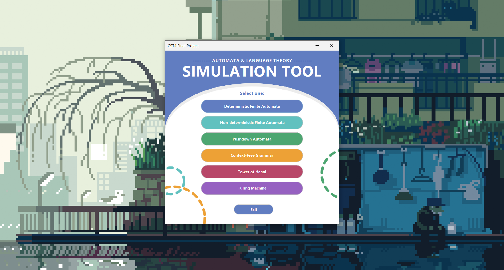
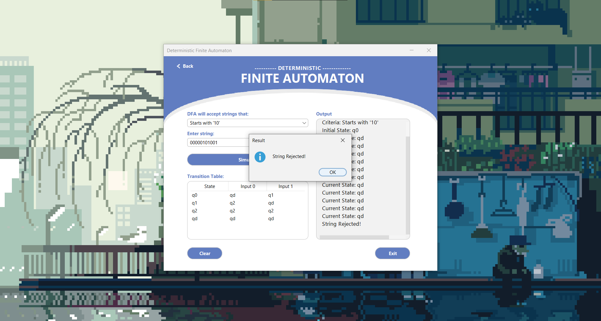
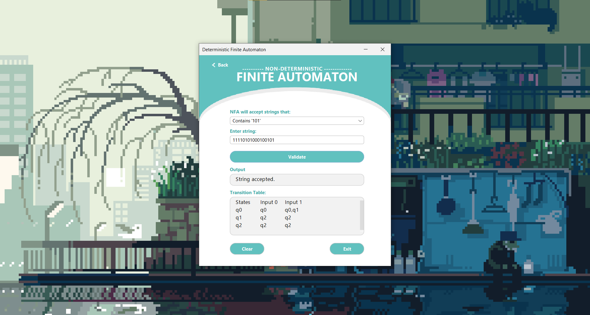
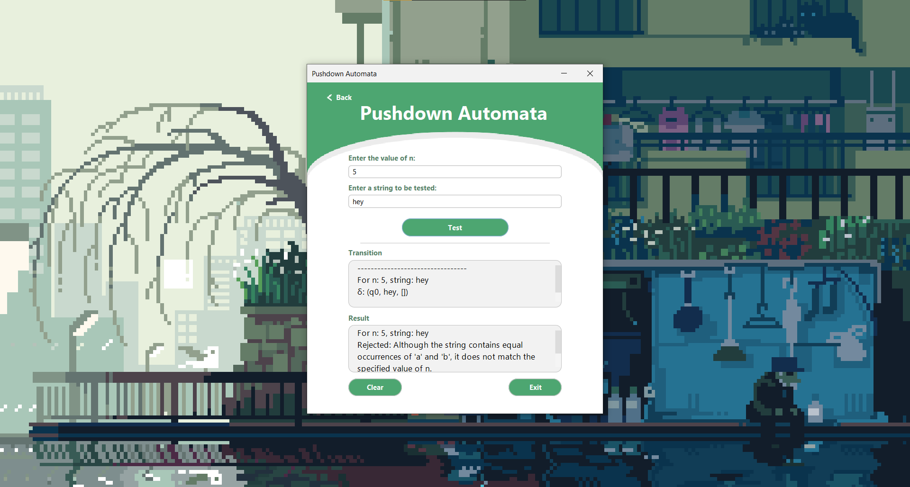
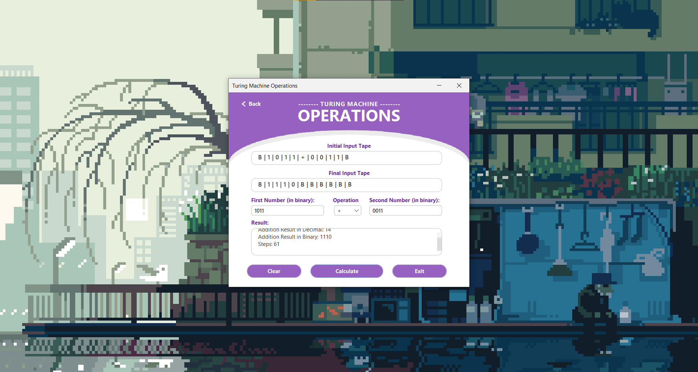
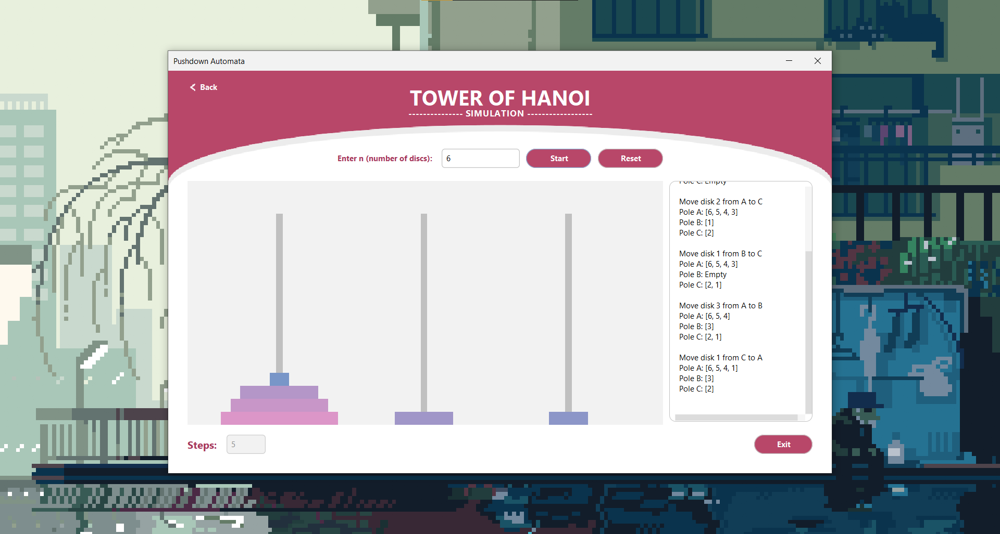

# Automata Theory Simulator

### Java-Based Educational Tool for Automata Theory and Computation

Automata Theory Simulator is a desktop-based educational application developed using Java Swing and NetBeans. The program provides interactive simulations of fundamental computational models, allowing users to explore automata theory concepts through string validation, state transitions, recursive algorithms, and formal language processing.

## Overview

This project was developed as part of our Theory of Computation coursework to bridge the gap between abstract computer science concepts and practical visualization. Automata theory is often difficult to understand due to its highly theoretical nature, so the application was designed to provide an interactive environment where users can experiment with different computational models and observe their behavior in real time.

The simulator includes implementations of Deterministic Finite Automata (DFA), Non-Deterministic Finite Automata (NFA), Pushdown Automata (PDA), Context-Free Grammars (CFG), Turing Machines, and the Tower of Hanoi problem.

## Features

* Deterministic Finite Automata (DFA) simulation
* Non-Deterministic Finite Automata (NFA) simulation
* Pushdown Automata (PDA) simulation
* Context-Free Grammar (CFG) validation
* Turing Machine computation simulation
* Tower of Hanoi recursive solver
* String validation and language acceptance testing
* State transition visualization
* Interactive graphical user interface

## Technologies Used

* Java
* Java Swing
* NetBeans IDE
* Data Structures (Arrays and Stacks)
* Automata Theory Concepts
* Formal Language Theory

## Project Structure

```text
src/            Source code
screenshots/    Application screenshots
docs/           Project documentation
assets/         Application resources
```

## Running the Project

1. Clone this repository.
2. Open the project in NetBeans IDE.
3. Resolve problems with FlatLaf by clicking Resolve Problem and selecting the flatlaf-3.5.2.jar file in the root folder.
4. Run the application.
5. Select a computational model from the interface.
6. Test strings, operations, or simulations using the provided examples.

## Screenshots

### Main Menu



### DFA Simulation



### NFA Simulation



### PDA Simulation



### Turing Machine



### Tower of Hanoi



## Future Improvements

* Custom automata creation and editing
* Graphical state diagram visualization
* User-defined transition tables
* Additional formal language models
* Step-by-step execution animations
* Exportable simulation reports

## Contributors

This project was developed as a group project.

### Team Members

- Christian James Cahilig
- Bai Fatima Andong
- Fionnah Keiz Coyoca
- Karylle Mish Gellica
- John Llorie Sarmiento

## Learning Outcomes

* Automata Theory and Formal Languages
* Computational Models and State Machines
* Recursive Algorithm Design
* Stack-Based Computation
* Java GUI Development
* Event-Driven Programming
* Problem Solving and Logical Analysis
* Translating Theoretical Concepts into Software Applications
